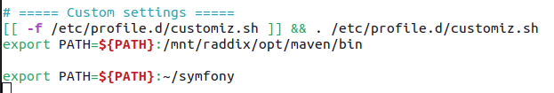
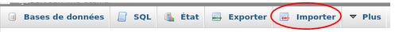
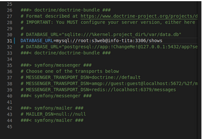
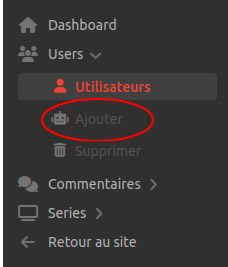
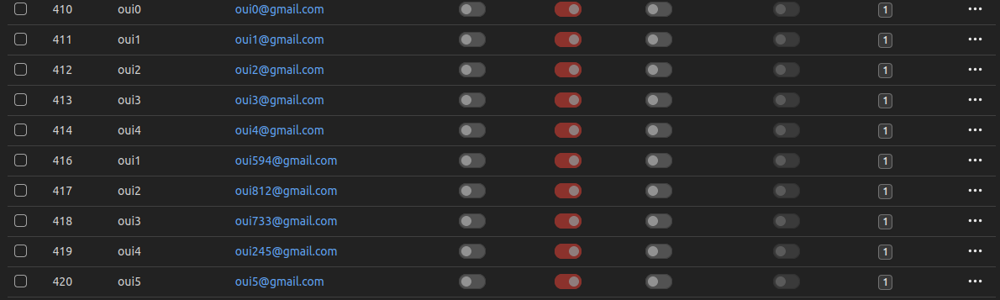
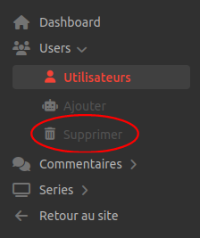
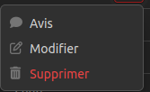

# SAE_S3.01

# Guide de déploiement


## Table des matières
1.[Installation de symfony](#installation-de-symfony)
2.[Configuration de la base de donnée](#configuration-BD)
3.[Configuration de l’application](#configuration-de-lapplication)
4.[Implémentation d’un super admin](#implem-super-admin)
5.[Génération d'utilisateurs aléatoires](#generation-Utilisateur-Alea)
6.[Génération de commentaires aléatoires](#generation-Commentaires-Alea)

&nbsp;

### Installation de symfony <a id="installation-de-symfony"></a>

***
Pour installer symfony il faut télécharger l'outil en ligne de commande [symfony](https://symfony.com/download) (choisissez les binaires AMD64), placez les dans un dossier (par exemple symfony) et ajoutez ce dossier dans votre $PATH.

Pour ajoutez ce dossier dans votre $PATH il faut tout d'abord accéder à votre fichier .bashrc, pour cela faite la commande 

```
export PATH=$PATH:$HOME/symfony
```
Voici un exemple ci-dessous:


Symfony et les commandes symfony devraient maintenant fonctionner.
Nous allons maintenant passer à la configuration de la base de données.

&nbsp;

### Configuration de la base de données <a id="configuration-BD"></a> 

***
Pour pouvoir lancer l'application, il vous faut la base de données MySQL/MariaDB correspondante.
Cette base de données est nommée shows et elle est contenu, au format .zip, dans le dossier qui contient le guide de déploiement.

Maintenant que vous posséder la base de données, il faut l'importer dans votre base MySQL. Pour cela accéder à votre système de gestion de base de données. On prendra comme exemple phpMyAdmin.
Lorsque vous vous êtes connecté, en haut de votre page faites importer comme le montre l’image ci-dessous:


Sélectionner la base shows.sql.zip comme fichier à importer.
Vous avez maintenant la base de données de votre application qui est accessible.

Il faut maintenant lier la base de données à l’application.
Pour cela il faut modifier le fichier .env de l’application symfony et ajouter la ligne suivante:
```
DATABASE_URL=mysql://[identifiant]:[motdepasse]@[serveur de la base de données]:3306/[nom de la base de données]
```
Les mots entre crochet sont à remplacer par de vrai variables.
Exemple ci-dessous :


&nbsp;

### Configuration de l’application <a id="configuration-de-lapplication"></a> 
***
Pour finir la configuration de l’application il vous faut installer les différents composants requis pour son bon fonctionnement, pour cela il faut taper dans un terminal la commande :
```
$ symfony composer install
```
Maintenant vous avez tous les composants pour faire fonctionner l’application, il ne vous reste plus écrire dans un terminal la commande:
```
$ symfony serve
```
Puis de lancer votre navigateur web et de mettre en URL http://127.0.0.1:8000/

&nbsp;

### Implémentation d’un super admin <a id="implem-super-admin"></a> 
***
L’application permet la création d’un super administrateur permettant de nommer des utilisateurs administrateur.

Pour créer un super administrateur il faut tout d’abord lancer l’application, puis ouvrir un terminal de commande, aller dans le répertoire courant du projet et lancer la commande suivante:
```
$ symfony console create:super-admin [email] [nom] [mot de passe] [pays] 
```
Les mots entre crochet sont à remplacer par de vrai variables.
Voici un exemple ci-dessous:


&nbsp;

### Génération d'utilisateurs aléatoires <a id="generation-Utilisateur-Alea"></a> 
***

L'application permet aux administrateurs de générer des utilisateurs aléatoires dans la base de données.
Pour cela il faut se connecter à un compte administrateur puis aller dans le Dashboard administrateur.

Ensuite il faut aller dans l'onglet users et aller dans ajouter comme indiquez dans l'image ci-dessous:


Pour ajouter les utilisateurs il faut renseigner le nom et l'email que les utilisateurs auront. Un numéro s'ajoutera à la suite du nom ainsi qu'a la suite de l'email avant le @.
**Pour les emails il faut obligatoirement mettre les @.**
Puis dans la catégorie nombre il faut renseigner le nombre de faux que vous voulez générer.

Exemple de faux comptes:


Pour pouvoir supprimer **tous les faux comptes utilisateurs** vous disposez d'un bouton se situant en dessous de celui de l'ajout de faux comptes.



&nbsp;

### Génération de commentaires aléatoires <a id="generation-Commentaires-Alea"></a> 
***
Pour ajouter de faux commentaires à une série, il faut **obligatoirement** avoir de faux comptes utilisateurs.

Lorsque les faux comptes ont été créer, vous pouvez vous rendre dans l'onglet commentaires puis aller dans la catégorie ajouter.

Choisissez ensuite la série dans laquelle il faut ajouter les faux commentaires puis cliquez sur les 3 petit points.



Puis ajoutez le nombre de faux commentaires que vous souhaitez.

### Ajouter des séries via OMDB <a id="ajout_series_omdb"></a> 
***
Pour ajouter des séries à la base de données il faut se rendre dans le dashboard admin et cliquer sur l'onglet série puis dans ajouter.
Vous vous retrouverez normalement sur cette page:


Sur cette page, chercher le nom de la série à ajouter puis ajouter là.
